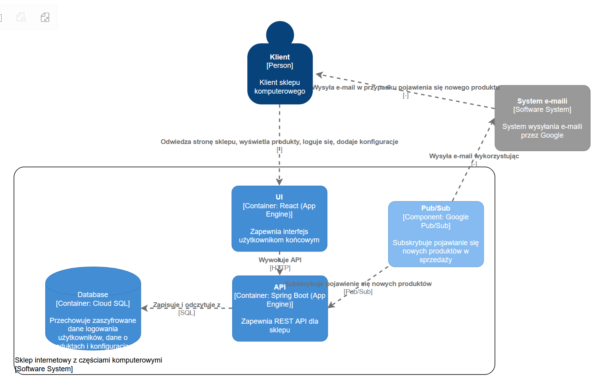

# Projekt sklep-gcp

Aplikacja internetowa sklepu z częściami komputerowymi hostowana na GCP, której baza danych znajdować się będzie w usłudze Cloud SQL, backend jest napisany Spring Boocie, a frontend w React i będą one hostowane w App Engine. Użytkownicy będą mogli tworzyć konta, dostępne będą konta zwykłego użytkownika oraz konta admina. Admin będzie mieć możliwość dodawania nowych produktów do bazy sklepu. Wykorzystany zostanie też system Pub/Sub do powiadamiania klientów o nowych produktach w sklepie. Użytkownicy będą mogli tworzyć swoje konfiguracje komputerowe z produktów dostępnych w sklepie. Możliwości wyboru części zmieniają się dynamicznie w zależności od wybranych komponentów. Aplikacja będzie budowana przy pomocy Cloud Build.

## Diagram C2

